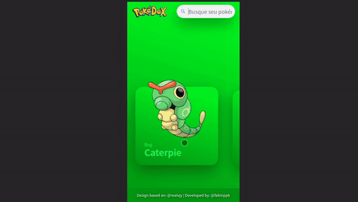

# Pokedex - React

## Prints




## Demo - https://pokedex-slide.herokuapp.com/

(Se tiver problema ao abrir, tente recarregar a página mais de uma vez)

## Requirements

For development, you will only need Node.js installed on your environement.

## Install Node

[Node](http://nodejs.org/) is really easy to install & now include [NPM](https://npmjs.org/) or [YARN](https://yarnpkg.com/pt-BR/).
You should be able to run the following command after the installation procedure
below.

    $ node --version
    v10.15.2

    $ npm --version || yarn --version
    6.9.0

## Run project on development mode:

```
$ npm i
$ npm run dev
```

## Generate a build:

```
$ npm i
$ npm run build
```

## Run project on production mode:

```
$ npm i
$ npm run build && npm run start
```

## Before make commit:

```
$ npm run commit
```

## Run lint:

```
$ npm i
$ npm run lint
```

## Run tests:

```
$ npm i
$ npm run test
```

## Run tests (watch mode):

```
$ npm i
$ npm run test:watch
```

## Run tests (coverage mode):

```
$ npm i
$ npm run test:coverage
```
